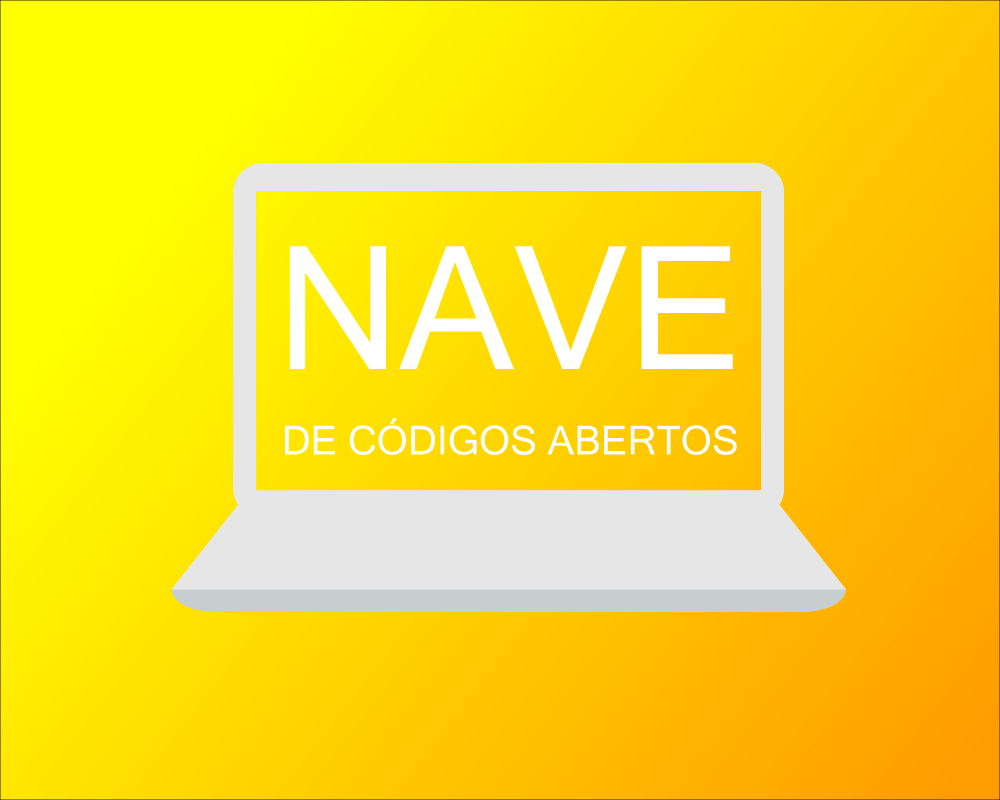

#NAVE de códigos abertos

## Quem é esse ai que está dando a palestra? - 05min

* Eu
* <a href="http://www.mtistudio.com/site2014/" target="_blank">Onde trabalho</a>  
* Minha vida relacionada ao Git e GitHub

======================================================

### Esse lance ai de código aberto, sei não hein!!! - 10min

====================================================== 

### Vendo a prática do OpenSource :smile: - 05min

* WebSchool - Da comunidade para a comunidade
* <a href="http://nomadev.com.br/js4girls-a-miss%C3%A3o/" target="_blank">JS4Girls</a>
* <a href="https://www.youtube.com/watch?v=toCdZ2e9Dh4" target="_blank">500 dias de OpenSouce - Raphael Amorim</a>
* <a href="https://github.com/raphamorim/write-code-every-day" target="_blank">write-code-every-day</a> - Uma boa ideia de contribuição

=================================================================== 

### Praticando o OpenSource - 10min

* Um projeto OpenSource
* README - Uma grande parte do meu projeto

===================================================================

### É hora de contribuir - 10min

* O que deve ser feito :question:
* Dando Fork em um projeto
* Fazendo de um jeito certo
* Enviando minha contribuição
* Verificando os 'Pull Request'

====================================================================
